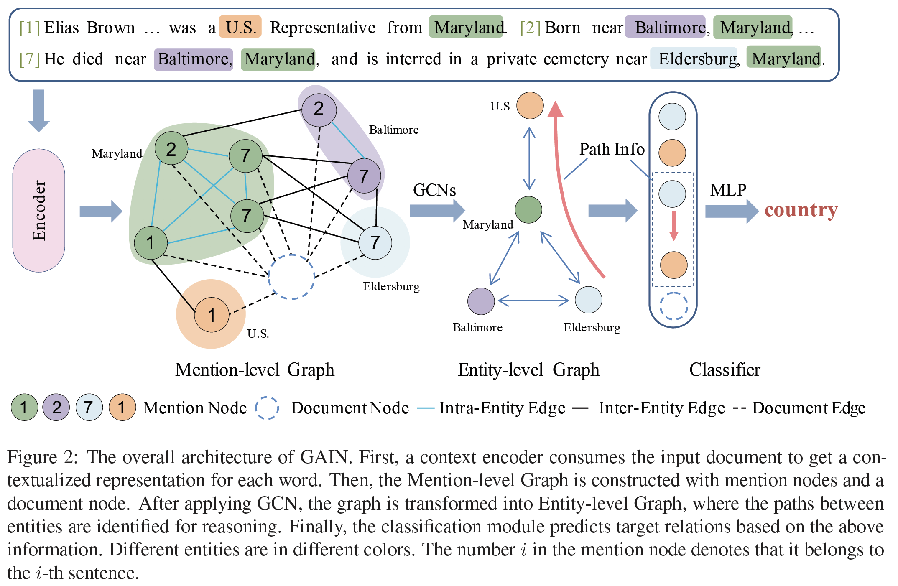

# Double Graph Based Reasoning for Document-level Relation Extraction
Source code for EMNLP 2020 paper: [Double Graph Based Reasoning for Document-level Relation Extraction](https://arxiv.org/abs/2009.13752)

> Document-level relation extraction aims to extract relations among entities within a document. Different from sentence-level relation extraction, it requires reasoning over multiple sentences across a document. In this paper, we propose Graph Aggregation-and-Inference Network (GAIN) featuring double graphs. GAIN first constructs a heterogeneous mention-level graph (hMG) to model complex interaction among different mentions across the document. It also constructs an entity-level graph (EG), based on which we propose a novel path reasoning mechanism to infer relations between entities. Experiments on the public dataset, DocRED, show GAIN achieves a significant performance improvement (2.85 on F1) over the previous state-of-the-art.

+ Architecture


+ Overall Results

## 0. Package Description
```
GAIN/
├─ code/
    ├── checkpoint/: save model checkpoints
    ├── fig_result/: plot AUC curves
    ├── logs/: save training / evaluation logs
    ├── models/:
        ├── GAIN.py: GAIN model for GloVe or BERT version
        ├── GAIN_nomention.py: GAIN model for -hMG ablation
    ├── config.py: process command arguments
    ├── data.py: define Datasets / Dataloader for GAIN-GloVe or GAIN-BERT
    ├── test.py: evaluation code
    ├── train.py: training code
    ├── utils.py: some tools for training / evaluation
    ├── *.sh: training / evaluation shell scripts
├─ data/: raw data and preprocessed data about DocRED dataset
    ├── prepro_data/
    ├── README.md
├─ PLM/: save pre-trained language models such as BERT_base / BERT_lagrge
    ├── bert-base-uncased/
    ├── bert-large-uncased/
├─ test_result_jsons/: save test result jsons
├─ LICENSE
├─ README.md
```

## 1. Environments

- python         (3.7.4)
- cuda           (10.2)
- Ubuntu-18.0.4  (4.15.0-65-generic)

## 2. Dependencies

- numpy          (1.19.2)
- matplotlib     (3.3.2)
- torch          (1.6.0)
- transformers   (3.1.0)
- dgl-cu102      (0.4.3)
- scikit-learn   (0.23.2)

PS: dgl >= 0.5 is not compatible with our code, we will fix this compatibility problem in the future.

## 3. Preparation

### 3.1. Dataset
- Download data from [Google Drive link](https://drive.google.com/drive/folders/1c5-0YwnoJx8NS6CV2f-NoTHR__BdkNqw) shared by DocRED authors

- Put `train_annotated.json`, `dev.json`, `test.json`, `word2id.json`, `ner2id.json`, `rel2id.json`, `vec.npy` into the directory `data/`

- If you want to use other datasets, please first process them to fit the same format as DocRED.

### 3.2. (Optional) Pre-trained Language Models
Following the hint in this [link](http://viewsetting.xyz/2019/10/17/pytorch_transformers/?nsukey=v0sWRSl5BbNLDI3eWyUvd1HlPVJiEOiV%2Fk8adAy5VryF9JNLUt1TidZkzaDANBUG6yb6ZGywa9Qa7qiP3KssXrGXeNC1S21IyT6HZq6%2BZ71K1ADF1jKBTGkgRHaarcXIA5%2B1cUq%2BdM%2FhoJVzgDoM7lcmJg9%2Be6NarwsZzpwAbAwjHTLv5b2uQzsSrYwJEdPl7q9O70SmzCJ1VF511vwxKA%3D%3D), download possible required files (`pytorch_model.bin`, `config.json`, `vocab.txt`, etc.) into the directory `PLM/bert-????-uncased` such as `PLM/bert-base-uncased`.

## 4. Training

```bash
>> cd code
>> ./runXXX.sh gpu_id   # like ./run_GAIN_BERT.sh 2
>> tail -f -n 2000 logs/train_xxx.log
```

## 5. Evaluation

```bash
>> cd code
>> ./evalXXX.sh gpu_id threshold(optional)  # like ./eval_GAIN_BERT.sh 0 0.5521
>> tail -f -n 2000 logs/test_xxx.log
```

PS: we recommend to use threshold = -1 (which is the default, you can omit this arguments at this time) for dev set, 
the log will print the optimal threshold in dev set, and you can use this optimal value as threshold to evaluate test set.

## 6. Submission to LeadBoard (CodaLab)
- You will get json output file for test set at step 5. 

- And then you can rename it as `result.json` and compress it as `result.zip`. 

- At last,  you can submit the `result.zip` to [CodaLab](https://competitions.codalab.org/competitions/20717#participate-submit_results).

## 7. License

This project is licensed under the MIT License - see the [LICENSE](LICENSE) file for details.

## 8. Citation

If you use this work or code, please kindly cite the following paper:

```bib
@inproceedings{zeng-etal-2020-gain,
    title = "Double Graph Based Reasoning for Document-level Relation Extraction",
    author = "Zeng, Shuang  and
      Xu, Runxin  and
      Chang, Baobao  and
      Li, Lei",
    booktitle = "Proceedings of the 2020 Conference on Empirical Methods in Natural Language Processing (EMNLP)",
    year = "2020",
    publisher = "Association for Computational Linguistics",
    url = "https://www.aclweb.org/anthology/2020.emnlp-main.127",
    pages = "1630--1640",
}
```

## 9. Contacts

If you have any questions, please feel free to contact [Shuang Zeng](mailto:zengs@pku.edu.cn), we will reply it as soon as possible.

